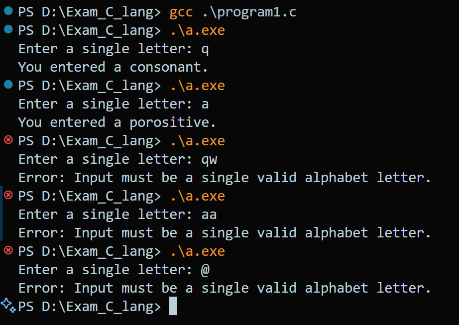
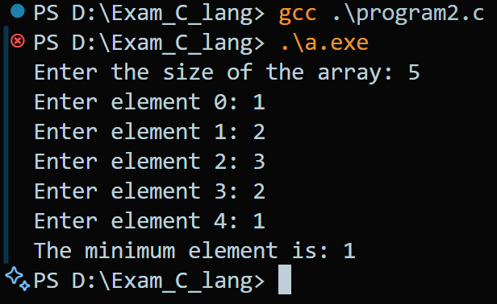
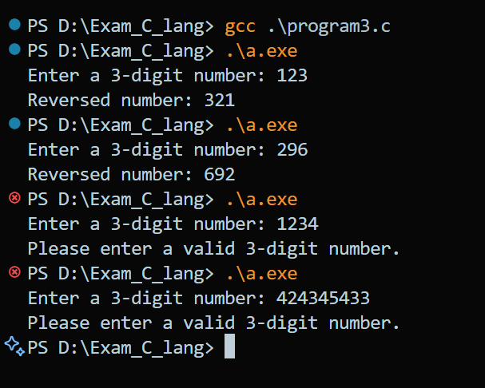
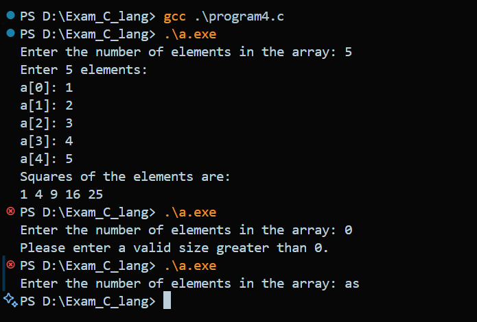
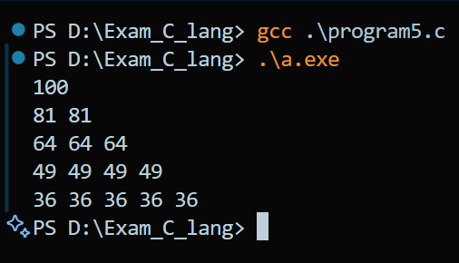

# Exam

## Program 1

### Code

```c

#include <stdio.h>
#include <ctype.h>
#include <string.h>

// Create a C program to check if a letter is entered by the user is a porositive or constant using a switch statement

int main()
{
    char input[10], letter;

    printf("Enter a single letter: ");
    fgets(input, sizeof(input), stdin);

    if (strlen(input) > 2 || !isalpha(input[0]) || input[1] != '\n')
    {
        printf("Error: Input must be a single valid alphabet letter.\n");
        return 1;
    }

    letter = input[0];

    switch (letter)
    {
    case 'a':
    case 'e':
    case 'i':
    case 'o':
    case 'u':
    case 'A':
    case 'E':
    case 'I':
    case 'O':
    case 'U':
        printf("You entered a porositive.\n");
        break;
    default:
        printf("You entered a consonant.\n");
        break;
    }

    return 0;
}

```

### Output



## Program 2

### Code

```c

#include <stdio.h>

void main()
{
    int size;
    printf("Enter the size of the array: ");
    scanf("%d", &size);

    int a[size];

    int i;

    for (i = 0; i < size; i++)
    {
        printf("Enter element %d: ", i);
        scanf("%d", &a[i]);
    }

    int min = a[0];

    for (i = 1; i < size; i++)
    {
        if (a[i] < min)
        {
            min = a[i];
        }
    }

    printf("The minimum element is: %d\n", min);
}

```

### Output



## Program 3

### Code

```c

#include <stdio.h>

// Write a C program that defines a function to reverse a 3 digit number

void reverseNumber(int num);

int main() {
    int number;

    printf("Enter a 3-digit number: ");
    scanf("%d", &number);

    if (number < 100 || number > 999) {
        printf("Please enter a valid 3-digit number.\n");
        return 1;
    }

    reverseNumber(number);

    return 0;
}

void reverseNumber(int num) {
    int reversed = 0;

    while (num > 0) {
        int digit = num % 10;
        reversed = reversed * 10 + digit;
        num /= 10;
    }

    printf("Reversed number: %d\n", reversed);
}

```

### Output



## Program 4

### Code

```c

#include <stdio.h>

// Write a C program to find square of each elements of an 1D array using Pointer

void findSquare(int *a, int size);

int main() {
    int size;

    printf("Enter the number of elements in the array: ");
    scanf("%d", &size);

    if (size <= 0) {
        printf("Please enter a valid size greater than 0.\n");
        return 1;
    }

    int a[size];

    printf("Enter %d elements:\n", size);
    for (int i = 0; i < size; i++) {
        printf("a[%d]: ", i);
        scanf("%d", &a[i]);
    }

    findSquare(a, size);

    return 0;
}

void findSquare(int *a, int size) {
    printf("Squares of the elements are:\n");
    for (int i = 0; i < size; i++) {
        printf("%d ", (*(a + i)) * (*(a + i)));
    }
    printf("\n");
}

```

### Output



## Program 5

### Code

```c

#include <stdio.h>

/*
    Print a below pattern using nested for loop in C language:
    100
    81 81
    64 64 64
    49 49 49 49
    36 36 36 36 36
*/

int main() {
    int n = 5;
    int start = 100;

    for (int i = 1; i <= n; i++) {
        for (int j = 1; j <= i; j++) {
            printf("%d ", start);
        }
        printf("\n");
        start -= (2 * ((n - i) + 5) + 1);
    }

    return 0;
}

```

### Output

